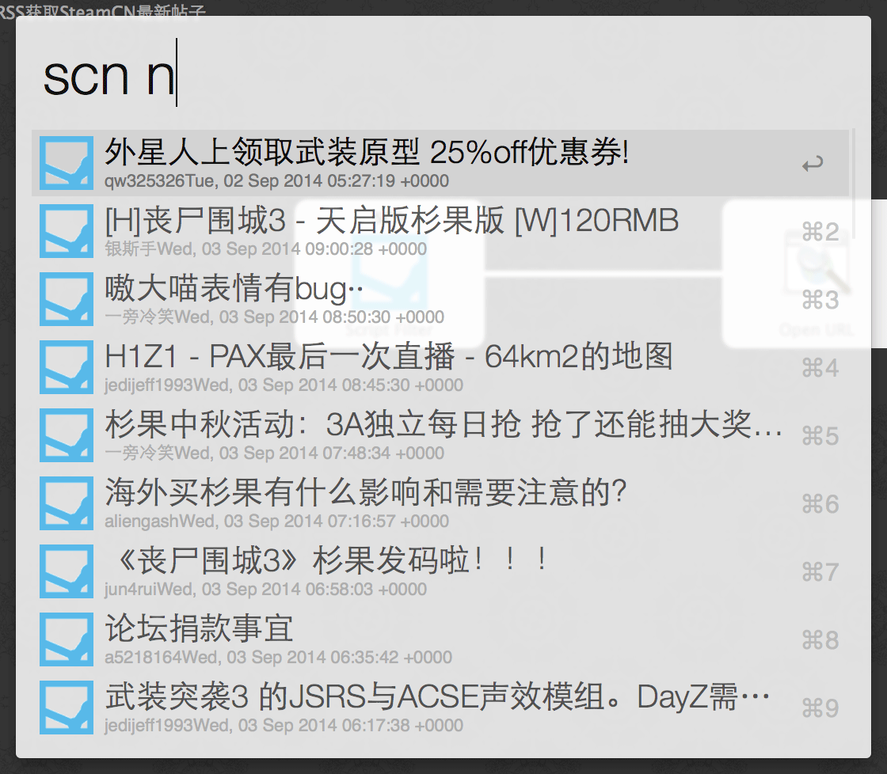

# SteamCN

获取[蒸汽动力](http://steamcn.com)论坛新帖列表的 Alfred 2 workflow。

### Development

由[池大](http://macshuo.com/)的 [FindYYeTs](https://github.com/jackychi/FindYYeTs) 改写而来。感谢池大~

原理是读取 SteamCN 的最新主题 RSS 源并解析成 Alfred 2能够识别的 XML 格式。

### Requirements

- Alfred 2 with Powerpack
- Python 2.7

### Installation

下载 `SteamCN.alfredworkflow`，双击导入 Alfred 2即可。

### Usage

- 呼出 Alfred 2， 输入 `scn n` 或 `scn new`
- 回车即在默认浏览器中打开帖子链接

### Screenshot

